# Quantum Network Timing Attacks and Side-Channel Analysis

## Abstract

This repository contains simulations and analyses of timing-based side-channel attacks on quantum networks and distributed quantum computing (DQC) architectures. Using the NetSquid quantum network simulation framework, we investigate how contention in shared entanglement services and cross-module communication in modular quantum systems can leak timing information, enabling attackers to infer victim workloads or circuit structures.

The project evaluates three DQC execution modes (monolithic, sequential modular, static distributed) across multiple quantum circuits (Bernstein-Vazirani, Deep Neural Network inference, Quantum Fourier Transform, SAT solver, and square root) and implements various attack strategies including periodic probing, bursty attacks, and synchronized schedules.

Key contributions include:
- Demonstration of timing leakage in Bell State Measurement (BSM) contention
- Quantification of cross-module communication overhead in modular architectures
- Evaluation of attack detection rates under different placement and scheduling strategies
- Comprehensive performance benchmarks across execution modes

## Project Structure

### Core Simulation Files
- `experiment_a.py`, `experiment_a2.py`, `experiment_a3_combined.py`: Basic timing leakage experiments in entanglement services
- `run_monolithic.py`: Monolithic execution simulation
- `run_sequential_modular.py`, `run_sequential_modular_v2.py`: Sequential modular execution
- `run_static_distributed.py`: Static distributed execution
- `run_attack_tier1_*.py`: Tier-1 attack simulations for different placements and probes

### Architecture Implementation
- `new_arch_baseline.py`: Baseline architecture definitions
- `new_arch_baseline_fivenode.py`: Five-module superconducting DQC architecture
- `new_arch_fivenode_traceadded.py`: Architecture with trace processing capabilities

### Quantum Circuits
- `bv_n19.qasm`: Bernstein-Vazirani algorithm (19 qubits)
- `dnn_n16.qasm`: Deep Neural Network inference (16 qubits)
- `qft_n18.qasm`: Quantum Fourier Transform (18 qubits)
- `sat_n11.qasm`: SAT solver (11 qubits)
- `square_root_n18.qasm`: Square root algorithm (18 qubits)
- `qaoa_nativegates_ibm_qiskit_opt3_*.qasm`: QAOA circuits with varying depths

### Results and Analysis
- `*_stats.json`: Performance statistics for different execution modes
- `*_results.json`: Attack simulation results
- `plot_*.py`: Plotting scripts for visualization
- `*.png`: Generated plots and figures
- `bv_results/`, `QFT_results/`, `square_root_n18_results/`: Circuit-specific P1 static attack outputs for BV, QFT, and square-root workloads
- `Disjoint_allocation/`: P1/disjoint-allocation sweeps, sequential best-attack runs, and QAOA-family distinguishability artifacts
- `Overlapped_allocation/`: P2/overlap attack sweeps, static overlap runs, and QAOA-family distinguishability artifacts
- `selecting_best_probe_probe3/`: Probe-selection burst sweeps comparing probe families on communication-heavy circuits

### Dependencies
- `netsquid_clean_env.yml`: Conda environment specification
- `netsquid_clean_pip_freeze.txt`: Python package requirements

## Architectures Evaluated

### Monolithic Execution
All qubits mapped to a single compute module. No cross-module communication, minimal timing leakage.

### Sequential Modular Execution
Circuit decomposed into stages executed sequentially across modules. Introduces cross-module entanglement operations with associated delays.

### Static Distributed Execution
Parallel execution across multiple modules with static qubit allocation. Highest cross-module traffic and potential for timing leakage.

## Attack Models

### Tier-1 Attacks
Attacker probes shared resources (hub or entanglement services) to detect victim activity through latency variations.

#### Placements
- **P1**: Victim uses modules 0-2, attacker uses 3-4 (no shared compute modules)
- **P2**: Partial overlap - victim and attacker share some modules

#### Probes
- **Probe 1**: CX chain operations
- **Probe 2**: Bursty entangling gates
- **Probe 3**: Light periodic probes

#### Schedules
- A1: Victim-only baseline
- A2: Always-on overlap
- A3: Front-loaded attacks
- A4: Back-loaded attacks
- A5: Periodic probing
- A6: Bursty synchronized
- A7: Saturation attacks

## Results

### Baseline Performance Comparison

| Execution Mode | Total Events | Local Events | Cross-Module Events | Avg Waiting Time (ns) | Max Waiting Time (ns) | Hub Makespan (ns) |
|----------------|--------------|--------------|---------------------|----------------------|----------------------|-------------------|
| Monolithic | 558 | 558 | 0 | 0 | 0 | 2790 |
| Sequential Modular | 558 | 310 | 248 | 5641 | 12210 | 15010 |
| Sequential Modular v2 | 558 | 310 | 248 | 145 | 420 | 32480 |
| Static Distributed | 558 | 310 | 248 | 5641 | 12210 | 15010 |

*Note: All results based on the same quantum circuit (likely BV or similar). Sequential v2 shows optimized scheduling with reduced waiting but increased makespan.*

### Attack Detection Results Across Circuits (Sequential v2, P2 Placement, A5 Schedule)

| Circuit | Victim Cross Fraction | Attacker Completed | Avg Waiting Time (ns) | Max Waiting Time (ns) | Waited Fraction |
|---------|-----------------------|-------------------|----------------------|----------------------|-----------------|
| BV (n19) | 0.211 | 4 | 112.5 | 225 | 0.75 |
| DNN (n16) | 0.035 | 15 | 0.0 | 0 | 0.0 |
| QFT (n18) | 0.271 | 44 | 1028.1 | 2550 | 0.86 |
| SAT (n11) | 0.442 | 9 | 290.6 | 525 | 0.89 |
| Square Root (n18) | 0.443 | 50 | 1478.4 | 3225 | 0.98 |

*Note: Higher cross-module operation fractions correlate with higher attacker waiting times and detection rates.*

### Tier-1 Attack Results (BV Circuit, P1 Placement, Static Distributed, Probe 1)

| Schedule | Attacker Completed | Avg Waiting Time (ns) | Max Waiting Time (ns) | Waited Fraction |
|----------|-------------------|----------------------|----------------------|-----------------|
| A1 (Victim Only) | 0 | 0 | 0 | 0.0 |
| A2 (Always On) | 80 | 3668.9 | 7530 | 0.99 |
| A3 (Front Loaded) | 80 | 3952.5 | 7905 | 0.99 |
| A4 (Back Loaded) | 80 | 3952.5 | 7905 | 0.99 |
| A5 (Periodic) | 40 | 1637.0 | 3565 | 0.98 |
| A6 (Bursty Sync) | 120 | 5725.2 | 11630 | 0.99 |
| A7 (Saturation) | 120 | 5757.2 | 11530 | 0.99 |

*Note: Results show significant timing leakage under all overlap schedules, with bursty and saturation attacks experiencing the highest delays.*

### Additional Result Families Present In The Repository

The repository contains several broader experiment families beyond the summary tables above. These are already generated on disk and can be reproduced from the included driver scripts.

#### P1 Disjoint-Allocation Probe-3 Sweeps
- `Disjoint_allocation/probe3_rate_sweep_*`: Probe-rate sweeps across BV, DNN, QFT, SAT, and square-root circuits
- `Disjoint_allocation/probe3_spacing_R1_*` and `probe3_spacing_R2_*`: Inter-probe spacing sweeps for two rate regimes
- `Disjoint_allocation/probe3_R1_uniform_short_*`, `..._medium_*`, `..._long_*`: Time-scale sweeps for light periodic probing
- `Disjoint_allocation/probe3_R1_uniform_reldur_*` and `..._absdur_*`: Relative- and absolute-duration attack window sweeps

These files extend the README's current BV-only example by showing how timing leakage changes as the attacker varies probe density, spacing, and observation window width across multiple workloads.

#### Disjoint Sequential Best-Attack Families
- `Disjoint_allocation/sequential_bestattack_*`: Best-attack runs for sequential modular execution
- `Disjoint_allocation/sequential_bestattack_v2_*`: Best-attack runs for the optimized sequential modular v2 workflow

Both sets are available for BV, DNN, QFT, SAT, and square-root workloads and provide per-run JSON plus job-count, makespan, and request-level plots.

#### P2 Overlapped-Allocation Sweep Families
- `Overlapped_allocation/static_overlap_p2_*`: Static-distributed overlap runs for all five benchmark circuits
- `Overlapped_allocation/overlap_p2_pattern_*`: Pattern/schedule sweeps under partial module overlap
- `Overlapped_allocation/overlap_p2_r1_timescale_*`: Probe-3 time-scale sweeps for overlapped placement
- `Overlapped_allocation/overlap_p2_ratesweep_*`: Probe-density sweeps at `P20`, `P50`, and `P100`

These artifacts complement the top-level `sequential_v2_overlap_p2_*` results by covering additional overlap patterns and static-distributed attack scenarios.

#### QAOA Family Distinguishability And Fingerprinting

The repository includes full QAOA-family timing-fingerprint studies for QAOA circuits `qaoa_nativegates_ibm_qiskit_opt3_5.qasm` through `..._15.qasm`.

- `Disjoint_allocation/qaoa_family_best_attack_results.json`, `..._summary.csv`, `..._fingerprints.csv`, `..._pairwise_distance.csv`, `..._pairwise_distance.png`, `..._request_metrics.png`: P1/static-distributed QAOA distinguishability outputs
- `Disjoint_allocation/qaoa_family_best_attack_sequential_v2_results.json` and companion CSV/PNG files: Sequential modular v2 QAOA distinguishability outputs
- `Overlapped_allocation/qaoa_family_best_attack_overlap_p2_results.json` and companion CSV/PNG files: P2/one-module-overlap QAOA distinguishability outputs

These files capture attack fingerprints, request-level metrics, and pairwise distance matrices that quantify how well timing observations separate different QAOA instances.

#### Probe-Selection Burst Sweeps
- `selecting_best_probe_probe3/burst_sweep_qft_n18_probe_{1,2,3}_*`
- `selecting_best_probe_probe3/burst_sweep_square_root_n18_probe_{1,2,3}_*`

These burst-sweep experiments compare CX-chain, bursty-entangling, and light-periodic probes on QFT and square-root workloads to help select an effective probe family for highly communication-heavy circuits.

#### Additional Circuit-Specific Static Attack Folders
- `QFT_results/`: P1 static attack plots and JSON outputs for QFT under probes 1, 2, and 3
- `square_root_n18_results/`: P1 static attack plots and JSON outputs for square-root, including aggregate `tier1_p1_static_*` plots and per-probe breakdowns

Together with `bv_results/`, these folders provide circuit-level drill-downs that are more detailed than the summary tables in this README.

### Timing Leakage in Entanglement Services

Experiment A demonstrates significant latency shifts when victim load is present:

- **Victim OFF**: Mean latency ~X ns
- **Victim ON**: Mean latency ~Y ns
- **KS Statistic**: Z (indicating distributional difference)

## Images and Visualizations

### Baseline Performance

*Comparison of local and cross-module events across execution modes*


*Total event counts by execution mode*


*Average waiting times for hub requests*


*Worst-case waiting times for hub requests*


*Average turnaround times*


*Hub makespan comparison*


*Completed hub requests*


*Fraction or count of requests that experienced nonzero waiting*

### Per-Module Analysis

*Event distribution in monolithic mode*


*Event distribution in sequential modular mode*


*Event distribution in static distributed mode*

### Sequential Stage Profiles

*Stage-wise event counts*


*Stage-wise waiting times*

### Attack Results (BV Circuit Examples)

*Job completion counts for BV attacks*


*Job makespan for BV attacks*


*Request-level timing for BV attacks*

### Additional Attack Results
#### DNN Circuit


#### QFT Circuit


#### SAT Circuit


#### Square Root Circuit


### Tier-1 Attack Plots (BV Circuit, Probe 1)


#### Additional Probes


### Additional Circuit-Specific Attack Plot Collections
`QFT_results/` and `square_root_n18_results/` contain the same probe-1, probe-2, and probe-3 plot families shown above for BV, along with their corresponding `*_results.json` files. The square-root folder also includes aggregate `tier1_p1_static_job_counts.png`, `tier1_p1_static_job_makespan.png`, `tier1_p1_static_job_level.png`, and `tier1_p1_static_results.json` outputs.

### QAOA Distinguishability Visualizations

*Pairwise timing-distance matrix for the disjoint/static QAOA family study*


*Pairwise timing-distance matrix for the sequential modular v2 QAOA family study*


*Pairwise timing-distance matrix for the P2 overlapped-allocation QAOA family study*

### Sweep And Placement Study Outputs
- `Disjoint_allocation/` contains full JSON and PNG outputs for probe-rate, spacing, and time-scale sweeps across all benchmark circuits.
- `Overlapped_allocation/` contains static-overlap, pattern, time-scale, and rate-sweep outputs for all benchmark circuits.
- `selecting_best_probe_probe3/` contains burst-sweep comparisons used to choose between probe families on QFT and square-root workloads.

## Summary of Findings

### Key Insights

1. **Execution Mode Tradeoff Remains The Primary Security Driver**: Monolithic execution removes cross-module traffic and therefore minimizes timing leakage, while modular and distributed modes expose measurable contention at shared hub resources. Across the baseline data, sequential modular v2 reduces average waiting relative to the earlier sequential/static style runs, but it does not eliminate side-channel structure; it mainly shifts the performance-security tradeoff by lowering some queueing costs while increasing overall makespan.

2. **Leakage Strength Tracks Communication Structure Across Both Benchmarks And QAOA Families**: The benchmark circuits and the QAOA-family summaries both show that workloads with more cross-module activity produce stronger attacker-visible timing signatures. Low-cross workloads such as DNN remain comparatively quiet, while QFT, SAT, square-root, and many QAOA instances generate substantially higher waiting times, waited fractions, and job makespans for the attacker.

3. **Attack Intensity Is Tunable Rather Than Binary**: The rate, spacing, and time-window sweeps show that leakage can be dialed up or down by changing probe density and schedule shape. In the QAOA disjoint-allocation summaries, moving from light periodic windows such as `P20` to denser `P100` attacks raises attacker waiting from tens or low hundreds of nanoseconds to sustained sub-microsecond or multi-microsecond ranges, with waited fractions often climbing from roughly half the requests to nearly all requests.

4. **Placement Changes The Magnitude Of Leakage, Not Its Existence**: The P1 disjoint-allocation studies show that shared-hub contention alone is enough to leak victim activity, while the P2 overlapped-allocation studies amplify that signal through partial resource overlap. Even comparatively light `P20` overlap attacks in the QAOA overlap summaries still produce nonzero waiting and substantial waited fractions, confirming that overlap is not required for leakage but does intensify it.

5. **Timing Traces Support Workload Fingerprinting, Not Just Activity Detection**: The QAOA pairwise-distance and fingerprint artifacts show that timing observations can separate multiple closely related QAOA circuits from one another, not merely distinguish "busy" from "idle." This pushes the side channel from coarse workload detection toward algorithm-family fingerprinting and circuit identification.

### Implications for Quantum Security

- Modular DQC architectures inherently leak timing information through shared hub resources, regardless of module placement strategy
- Attackers can infer circuit structure and execution patterns via passive timing observation, with detection rates approaching 100% for communication-heavy circuits
- The QAOA-family studies indicate that passive timing can also support fingerprinting among related algorithm instances, not only detection of victim presence
- Mitigation strategies should focus on constant-time execution, noise injection, or fully distributed architectures without shared bottlenecks
- Architecture design must balance performance gains against security risks, particularly for sensitive quantum algorithms

### Future Work

- Implement additional attack tiers (active interference)
- Evaluate larger-scale architectures (16+ modules)
- Develop timing-oblivious scheduling algorithms
- Investigate quantum-specific countermeasures

## Setup and Usage

### Environment Setup
```bash
# Using conda
conda env create -f netsquid_clean_env.yml
conda activate netsquid-env

# Or using pip
pip install -r netsquid_clean_pip_freeze.txt
```

### Running Simulations
```bash
# Baseline performance
python run_monolithic.py
python run_sequential_modular_v2.py
python run_static_distributed.py

# Attack simulations
python run_attack_tier1_p1_static.py
python run_attack_tier1_p2_static_bestattack.py
python run_attack_tier1_p1_sequential_bestattack.py
python run_attack_tier1_p2_sequential_v2_bestattack.py
python run_attack_tier1_p1_static_probe3_ratesweep.py
python run_attack_tier1_p1_static_probe3_spacingsweep_R1.py
python run_attack_tier1_p1_static_probe3_spacingsweep_R2.py
python run_attack_tier1_p1_static_probe3_r1_uniform_short_timescale.py
python run_attack_tier1_p1_static_probe3_r1_uniform_medium_timescale.py
python run_attack_tier1_p1_static_probe3_r1_uniform_long_timescale.py
python run_attack_tier1_p1_static_probe3_r1_uniform_relativedurationsweep.py
python run_attack_tier1_p1_static_probe3_r1_uniform_absolutedurationsweep.py
python run_attack_tier1_p2_static_pattern_sweep.py
python run_attack_tier1_p2_static_r1_timescale_sweep.py
python run_attack_tier1_p2_static_probe3_rate_sweep.py
python qaoa_family_best_attack_overlap_p2.py

# Plotting
python plot_baseline_stats.py
```

### Generating Reports
Results are automatically saved as JSON files and plots as PNG images.

## References

- CCS 2026 Paper: See `CCS_2026 (1).pdf` for the full conference submission
- NetSquid Documentation: https://netsquid.org/
- Qiskit Documentation: https://qiskit.org/

## Authors

[Add author information if available]

## License

[Add license information if available]

---

> The original README above is preserved from the previous repository version. Part II documents the new black-box attack suite, corrected/refined analyses, saved results, and open-world implications.

# Part II — Black-Box Extension and Updated Analysis

## Overview

This repository contains simulation code, attack drivers, saved measurements, and analysis artifacts for timing side channels in quantum networks and distributed quantum computing (DQC) systems. The project begins with queueing and contention experiments for shared entanglement services, then develops a five-module superconducting DQC architecture and a sequence of increasingly realistic black-box attacks.

The newest work is under [`black_box_attack/`](black_box_attack/). It moves beyond attacks that know the victim circuit or exact execution schedule and asks what an attacker can infer using only the timing and success/failure behavior of its own probes. The new experiments cover:

- coarse activity detection and workload fingerprinting;
- probe-rate, probe-type, spacing, observation-window, and timing-uncertainty sweeps;
- dynamic placement, tenancy, communication-qubit allocation, and scheduling;
- rerouting/remapping and unknown-placement robustness;
- staged remote-operation protocols and individual shared-resource pipelines;
- endpoint, link, switch, measurement, feedforward, reset, and EPR contention;
- activity-intensity, execution-phase, endpoint, graph, protocol, retry-policy, and fidelity-demand inference;
- closed-world and open-world generalization.

The saved results support a qualified central conclusion:

> Shared DQC resources can expose attacker-visible timing signals that reveal victim activity and, in favorable settings, communication intensity, location, graph structure, protocol, and service intent. The signal is highly dependent on resource overlap and architecture, however, and several semantic classifiers degrade sharply under unseen placements or combined domain shift.

All headline claims below are derived from the saved CSV and JSON artifacts in this repository. They are simulator results, not measurements from a physical modular quantum computer.

## Contents

- [What is new](#what-is-new)
- [Authoritative and superseded results](#authoritative-and-superseded-results)
- [Repository structure](#repository-structure)
- [Architecture, workloads, and threat model](#architecture-workloads-and-threat-model)
- [Original execution-mode results](#original-execution-mode-results)
- [Original Tier-1 attack families](#original-tier-1-attack-families)
- [New black-box baseline and probe-design studies](#new-black-box-baseline-and-probe-design-studies)
- [Phase 1: deployment and resource-sharing realism](#phase-1-deployment-and-resource-sharing-realism)
- [Phase 2: causal remote-operation pipelines](#phase-2-causal-remote-operation-pipelines)
- [Phase 3: semantic inference](#phase-3-semantic-inference)
- [Validation and negative controls](#validation-and-negative-controls)
- [Results that were previously undocumented](#results-that-were-previously-undocumented)
- [Interpretation and security implications](#interpretation-and-security-implications)
- [Limitations](#limitations)
- [Setup and reproduction](#setup-and-reproduction)
- [Result-file guide](#result-file-guide)

## What is new

The previous repository version documented the original execution modes, P1/P2 Tier-1 attacks, probe sweeps, sequential best-attack runs, and QAOA distinguishability artifacts. The current local version adds an approximately 1.2 GB `black_box_attack` research package containing 38 Python programs, 16 QASM files, and 3,800+ saved result artifacts.

The conceptual progression is:

1. **Original work:** demonstrate timing leakage from hub and entanglement-service contention.
2. **Black-box baseline:** remove direct victim-trace knowledge from attacker scheduling and compare attacker-only with victim-present observations.
3. **Phase 1:** vary deployment policies that determine whether resources are actually shared.
4. **Phase 2:** replace a monolithic remote-operation delay with explicit causal stages and resource lifetimes.
5. **Phase 3:** infer increasingly semantic properties from attacker-visible timing features.
6. **Open-world evaluation:** test whether learned timing fingerprints survive unseen workloads, links, placements, and implementation changes.

The most important update is methodological: the newer scripts keep attacker-visible data separate from evaluator-only ground truth. Victim QASM, hidden placement, resource waits, EPR state, retries, and labels may be used to generate or score an experiment, but they are not intended to appear in the attacker's feature vector.

## Authoritative and superseded results

Several experiment families include corrected or refined reruns. Use the following precedence when citing results:

| Topic | Authoritative result | Superseded or diagnostic result | Reason |
|---|---|---|---|
| Phase 1.2 time slicing | `phase1_02_tenancy_models/time_sliced_corrected/` where a corrected time-sliced-only value is required | Initial time-sliced rows in the main Phase 1.2 run | Dedicated correction rerun is saved separately. |
| Phase 1.3 communication-qubit allocation | `phase1_03_communication_qubit_allocation/postprocessed/` | Uncorrected aggregate interpretations in the Phase 1.3 root | Postprocessing separates positive delay, negative speedup, failure leakage, successful-victim slowdown, and overlapping utilization components. |
| Phase 3.5 protocol/fidelity inference | `phase3/phase3.5.1/` | `phase3/phase3.5/` | Phase 3.5.1 gives TeleGate and TeleData different causal paths, controls the service-class comparison, and makes probe paths physically distinct. |
| Phase 3.6 generalization | `phase3/phase3.6/` | Closed-world Phase 3.5.1 metrics when making transfer claims | Phase 3.6 selects models on validation data and evaluates held-out and shifted domains. |

The raw files remain valuable for trace-level inspection, but corrected/refined summaries should be used for conclusions.

## Repository structure

### Original simulations and architecture

- `experiment_a.py`, `experiment_a2.py`, `experiment_a3_combined.py`: timing-leakage experiments for shared entanglement services.
- `new_arch_baseline.py`: baseline architecture definitions.
- `new_arch_baseline_fivenode.py`: five-module superconducting DQC architecture.
- `new_arch_fivenode_traceadded.py`: architecture with normalized trace generation.
- `run_monolithic.py`: monolithic execution.
- `run_sequential_modular.py`, `run_sequential_modular_v2.py`: sequential modular execution.
- `run_static_distributed.py`: static distributed execution.
- `run_attack_tier1_*.py`: original Tier-1 attack drivers.
- `plot_baseline_stats.py`: original aggregate plotting.

### Original result families

- `bv_results/`, `QFT_results/`, `square_root_n18_results/`: circuit-specific attack outputs.
- `Disjoint_allocation/`: P1/disjoint placement sweeps, sequential best-attack results, and QAOA-family artifacts.
- `Overlapped_allocation/`: P2/overlap sweeps and QAOA-family artifacts.
- `selecting_best_probe_probe3/`: probe-selection burst sweeps.
- `*_stats.json`, `*_results.json`, and top-level `*.png`: execution and attack summaries.

### New black-box package

```text
black_box_attack/
|-- run_attack_*blackbox*.py              # black-box baseline and controlled sweeps
|-- run_atack_*blackbox*.py               # sweep scripts; filenames retain the original "atack" spelling
|-- run_qaoa_circuit_noise_robustness.py  # noisy QAOA fingerprint evaluation
|-- phase1_*.py                           # placement, tenancy, allocation, scheduler, and robustness studies
|-- phase2_*.py                           # causal remote-operation and resource-pipeline studies
|-- phase3_*.py                           # semantic inference and open-world generalization
|-- *.qasm                                # benchmark and QAOA circuit inputs
|-- blackbox_results/                     # first black-box baseline outputs
`-- blackbox_window_results/              # windowed sweeps and Phase 1-3 outputs
```

The package contains no separate README in the current directory or ZIP archive. Its original documentation is embedded in module docstrings and result manifests; this file consolidates that material.

## Architecture, workloads, and threat model

### Execution modes

#### Monolithic execution

All qubits are mapped to one compute module. There is no cross-module communication and therefore no modeled cross-module timing channel.

#### Sequential modular execution

A circuit is divided into stages that execute across modules. Cross-module operations introduce communication requests and synchronization delay. The optimized `v2` workflow reduces queue waiting in the saved baseline but may increase overall makespan.

#### Static distributed execution

Circuit partitions execute across modules with a static mapping. Remote operations use shared communication resources and generate the strongest baseline exposure to contention.

### Five-module placement terminology

- **P1 / disjoint:** victim uses modules 0-2; attacker uses modules 3-4. Compute modules do not overlap, although global communication resources can still be shared.
- **P2 / one-module overlap:** victim and attacker share one module, enabling endpoint- or node-local contention in addition to global contention.

Later Phase 1 studies replace fixed P1/P2 placement with randomized allocators, tenancy policies, different module counts, and hidden placement knowledge.

### Benchmark circuits

| File | Workload | Nominal size |
|---|---|---:|
| `bv_n19.qasm` | Bernstein-Vazirani | 19 qubits |
| `dnn_n16.qasm` | DNN inference | 16 qubits |
| `qft_n18.qasm` | Quantum Fourier Transform | 18 qubits |
| `sat_n11.qasm` | SAT | 11 qubits |
| `square_root_n18.qasm` | Square-root circuit | 18 qubits |
| `qaoa_nativegates_ibm_qiskit_opt3_5.qasm` through `_15.qasm` | QAOA family | 5-15 qubits |

### Probe families

- **Probe 1:** CX-chain traffic.
- **Probe 2:** bursty entangling traffic.
- **Probe 3:** light periodic remote probes.

The black-box work generally treats a probe as an active measurement: the attacker submits its own operations and observes its own release, waiting, turnaround, completion, and failure behavior. Because the attacker consumes shared resources, this is an active side channel and can slow the victim.

### Attacker-visible versus evaluator-only data

The newer phases distinguish two data planes:

- **Attacker-visible:** chosen probe path/schedule, own timing, own success/failure, and features computed from those observations.
- **Evaluator-only:** victim identity, QASM structure, hidden placement, hidden protocol, exact victim phase boundaries, resource-level wait attribution, EPR state, retries, and semantic labels.

Evaluator-only data is used to generate labels and assess correctness. It should not be used as an input feature. Negative-control tasks and validation assertions check this separation in the later phases.

## Original execution-mode results

The original baseline table remains useful context for the black-box extensions.

| Execution mode | Total events | Local events | Cross-module events | Average wait (ns) | Maximum wait (ns) | Hub makespan (ns) |
|---|---:|---:|---:|---:|---:|---:|
| Monolithic | 558 | 558 | 0 | 0 | 0 | 2,790 |
| Sequential modular | 558 | 310 | 248 | 5,641 | 12,210 | 15,010 |
| Sequential modular v2 | 558 | 310 | 248 | 145 | 420 | 32,480 |
| Static distributed | 558 | 310 | 248 | 5,641 | 12,210 | 15,010 |

Sequential modular v2 trades lower queue waiting for a longer makespan. This illustrates why performance summaries alone do not determine security: scheduling can move a timing signature rather than remove it.

### Original sequential-v2 P2 attack example

| Circuit | Victim cross fraction | Attacker completed | Average wait (ns) | Maximum wait (ns) | Waited fraction |
|---|---:|---:|---:|---:|---:|
| BV n19 | 0.211 | 4 | 112.5 | 225 | 0.75 |
| DNN n16 | 0.035 | 15 | 0.0 | 0 | 0.00 |
| QFT n18 | 0.271 | 44 | 1,028.1 | 2,550 | 0.86 |
| SAT n11 | 0.442 | 9 | 290.6 | 525 | 0.89 |
| Square root n18 | 0.443 | 50 | 1,478.4 | 3,225 | 0.98 |

Higher cross-module fractions generally create stronger attacker-visible waiting, though temporal structure and resource mapping also matter.

## Original Tier-1 attack families

The original Tier-1 work includes:

- P1 static attacks across Probe 1, Probe 2, and Probe 3;
- P1 Probe-3 rate, spacing, relative-duration, absolute-duration, and timescale sweeps;
- P1 sequential and sequential-v2 best-attack runs;
- P2 static overlap, pattern, timescale, and rate sweeps;
- QAOA fingerprint and pairwise-distance studies under static, sequential-v2, and P2 overlap execution;
- probe-selection burst sweeps for QFT and square root.

For the original BV P1 static Probe-1 example:

| Schedule | Attacker completed | Average wait (ns) | Maximum wait (ns) | Waited fraction |
|---|---:|---:|---:|---:|
| A1 victim-only | 0 | 0 | 0 | 0.00 |
| A2 always-on | 80 | 3,668.9 | 7,530 | 0.99 |
| A3 front-loaded | 80 | 3,952.5 | 7,905 | 0.99 |
| A4 back-loaded | 80 | 3,952.5 | 7,905 | 0.99 |
| A5 periodic | 40 | 1,637.0 | 3,565 | 0.98 |
| A6 bursty synchronized | 120 | 5,725.2 | 11,630 | 0.99 |
| A7 saturation | 120 | 5,757.2 | 11,530 | 0.99 |

These attacks establish that contention is observable. The new black-box suite focuses on how much can be learned without direct victim-trace knowledge and under more realistic uncertainty.

## New black-box baseline and probe-design studies

### First baseline

`run_attack_tier1_p1_static_blackbox_baseline.py` creates paired attacker-only and victim-present executions. Victim QASM is used only to generate hidden traffic and evaluator ground truth; it is not used to schedule the attack.

The first saved outputs are in `blackbox_results/baseline/`. The windowed baseline in `blackbox_window_results/baseline/` uses a coarse victim-time window and is the reference for subsequent sweeps.

| Victim | Cross-module operations | Probe rounds | Mean excess turnaround (ns) | Contention fraction |
|---|---:|---:|---:|---:|
| Square root n18 | 247 | 48 | 17,767.5 | 1.000 |
| QFT n18 | 217 | 48 | 14,144.0 | 0.979 |
| DNN n16 | 72 | 48 | 678.5 | 0.521 |
| SAT n11 | 42 | 48 | 672.3 | 0.292 |
| BV n19 | 16 | 48 | 88.5 | 0.104 |

The baseline shows that communication intensity is visible, but cross-operation count is not the entire story: timing, burst structure, and overlap determine which probes actually contend.

### Probe-rate sweep

`run_atack_tier1_p1_static_blackbox_probe_rate_sweep.py` increases the realized remote-probe rate from 0.6 to 9.55 requests per microsecond.

| Rate setting | Realized probes/us | Mean contention fraction | Mean victim slowdown |
|---|---:|---:|---:|
| 0.25x sparse | 0.60 | 0.500 | 1.012x |
| 0.50x low | 1.20 | 0.542 | 1.017x |
| 1.00x baseline | 2.40 | 0.579 | 1.037x |
| 2.00x high | 4.80 | 0.692 | 1.088x |
| 3.00x dense | 7.15 | 0.850 | 1.151x |
| 4.00x saturation | 9.55 | 0.968 | 1.205x |

At saturation, the DNN workload reaches a 1.595x victim slowdown. This is security-relevant: stronger active probing creates a stronger signal but also a larger performance footprint that could support attack detection or rate limiting.

### Probe-type sweep

| Probe | Mean contention fraction | Mean excess turnaround (ns) | Mean victim slowdown |
|---|---:|---:|---:|
| Probe 1, CX chain | 0.683 | 7,999.9 | 1.096x |
| Probe 2, bursty entangling | 0.954 | 11,573.7 | 1.380x |
| Probe 3, light periodic | 0.579 | 6,670.2 | 1.037x |

Probe 2 is the strongest and most disruptive of the three. Probe 3 provides a lower-impact measurement channel and is therefore used extensively in later experiments.

### Inter-probe spacing

Uniform, alternating, burst-of-four, and jittered schedules all retain a signal in the saved results. Mean contention fractions remain near 0.579, except jittered spacing at 0.592. Mean victim slowdown ranges from 1.037x to 1.055x. This indicates that total probing demand dominates small spacing changes in this configuration, while schedule shape changes the local temporal fingerprint.

### Observation-window duration

| Window | Mean contention fraction | Mean excess turnaround (ns) |
|---|---:|---:|
| 5 us | 0.733 | 6,388.3 |
| 10 us | 0.692 | 7,394.7 |
| 20 us | 0.579 | 6,670.2 |
| 30 us | 0.519 | 5,408.8 |
| 40 us | 0.435 | 4,153.9 |

Longer windows dilute the fraction and average magnitude of affected probes because more probes occur outside the victim-active interval. Short windows produce denser evidence but require better timing knowledge.

### Window-start estimation and random victim starts

The deterministic start-error sweep shifts a fixed 20 us observation window from -10 us to +10 us around the true start. Exact alignment produces a mean contention fraction of 0.579. A -10 us error reduces it to 0.358; a +10 us error reduces it to 0.417.

The stronger randomized-victim-start experiment repeats trials under uncertainty:

| Start uncertainty | Mean signal retention | Mean detection probability | Minimum detection probability |
|---|---:|---:|---:|
| Exact | 1.000 | 1.000 | 1.000 |
| +/-0.5 us | 1.015 | 1.000 | 1.000 |
| +/-1 us | 0.973 | 1.000 | 1.000 |
| +/-2.5 us | 0.884 | 0.960 | 0.800 |
| +/-5 us | 0.747 | 0.880 | 0.500 |
| +/-10 us | 0.635 | 0.810 | 0.450 |

Coarse window knowledge is helpful but not strictly necessary. The signal degrades gradually rather than disappearing immediately.

### Hub capacity and placement

For P1/disjoint placement, a serialized hub with capacity 1 gives mean excess latency of 6,670 ns and nonzero signal in all five workloads. Raising hub capacity to 2, 3, or 4 eliminates the signal in this simplified baseline because victim and attacker can proceed concurrently.

P2 endpoint overlap restores leakage at capacity 2:

| Placement/capacity | Mean excess latency (ns) | Mean contention fraction | Workloads with signal |
|---|---:|---:|---:|
| P1 disjoint, capacity 1 | 6,670.2 | 0.579 | 5/5 |
| P1 disjoint, capacity 2 | 0.0 | 0.000 | 0/5 |
| P2 overlap, capacity 1 | 6,670.2 | 0.579 | 5/5 |
| P2 overlap, capacity 2 | 1,631.4 | 0.379 | 5/5 |

This is the first strong indication that **the identity of the shared resource matters more than co-location by itself**.

### QAOA circuit fingerprinting and noise robustness

The QAOA study covers 11 circuits from 5 to 15 qubits and nine start offsets per circuit. Mean contention and excess timing vary non-monotonically with size because the mapped cross-module pattern changes with the circuit.

Noise robustness was tested with timestamp noise, scheduler noise, and combined noise:

| Noise profile | Nearest-template accuracy | Random-forest accuracy | Chance |
|---|---:|---:|---:|
| Timestamp 5 ns | 1.000 | 1.000 | 0.091 |
| Timestamp 20 ns | 1.000 | 1.000 | 0.091 |
| Scheduler 20 ns | 0.964 | 0.927 | 0.091 |
| Combined 20 ns | 0.909 | 0.882 | 0.091 |
| Combined 50 ns | 0.791 | 0.836 | 0.091 |

The fingerprint remains well above chance under the synthetic noise profiles, although the samples come from the same simulator family and should not be interpreted as hardware-generalization evidence.

## Phase 1: deployment and resource-sharing realism

Phase 1 replaces fixed placement assumptions with deployment mechanisms that determine actual resource overlap.

### Phase 1.1: job-to-module allocation

Script: `phase1_01_job_module_allocation.py`

The allocator scales the architecture to 5, 8, 12, and 16 modules and compares placement policies, tenant counts, requested module counts, hub capacities, and interface capacities. Paired attacker-only and victim-present controls preserve the physical allocation.

Aggregated by the actual hidden sharing condition:

| Sharing condition | Mean detection probability | Mean excess latency (ns) | Mean victim slowdown |
|---|---:|---:|---:|
| Endpoint overlap | 0.990 | 1,239.5 | 1.072x |
| Switch-path-only overlap | 1.000 | 1,143.2 | 1.069x |
| Hub-only overlap | 0.203 | 1.2 | 1.000x |

Allocation policy therefore changes security mainly by changing the probability and type of physical sharing. Rejection and fragmentation summaries are saved alongside policy-level leakage tables.

Primary outputs include `job_module_allocation_trial_summary.csv`, `job_module_allocation_policy_summary.csv`, `job_module_allocation_sharing_summary.csv`, `job_module_allocation_rejection_summary.csv`, allocation logs, attacker knowledge views, and four plots.

### Phase 1.2: tenancy and module sharing

Script: `phase1_02_tenancy_models.py`

| Tenancy model | Acceptance | Shared module | Detection probability | Mean victim slowdown |
|---|---:|---:|---:|---:|
| Module exclusive | 0.722 | 0.000 | 0.000 | 1.000x |
| Dedicated communication interface | 0.356 | 1.000 | 0.164 | 1.014x |
| Spatial qubit partitioning | 0.593 | 1.000 | 0.182 | 1.016x |
| Shared communication interface | 0.593 | 1.000 | 0.193 | 1.017x |
| Hybrid shared pipeline | 0.356 | 1.000 | 0.201 | 1.017x |
| Time-sliced module sharing | 0.667 | 1.000 | 0.707 | 1.009x |

Module-exclusive tenancy removes the modeled node-side timing channel. Time slicing produces the strongest detection because activity alternates through a shared temporal resource even though mean victim slowdown remains comparatively small.

### Phase 1.3: communication-qubit allocation

Scripts: `phase1_03_communication_qubit_allocation.py` and `phase1_03_postprocess.py`

The experiment varies communication-qubit policies, capacity, tenancy, reservation/reset behavior, EPR coordination, and allocation granularity. The postprocessor is the authoritative interpretation.

Corrected aggregate results:

- 5,550 physical trials and 266,400 probe rows;
- 4,169 successful-victim trials and 1,381 victim-failure trials;
- positive-delay detection probability: 1.78%;
- negative-speedup detection probability: 0.62%;
- failure-only detection probability: 1.08%;
- combined signed-timing-or-failure detection probability: 3.49%;
- mean slowdown over successful victim executions: 1.110x;
- non-ML victim-presence accuracy: 48.3%, balanced accuracy 48.3%;
- random-forest victim-presence accuracy: 63.4%, balanced accuracy 63.4%, F1 0.585.

The random forest uses attacker-visible traces and holds out complete allocation configurations. The postprocessor also corrects EPR wastage and avoids calling overlapping resource-demand components a physical utilization fraction.

### Phase 1.4: remote-operation schedulers

Script: `phase1_04_remote_operation_schedulers.py`

The scheduler study varies scheduling policy, queue structure, priority, preemption, prefetch, capacity, communication-qubit availability, lookahead, decision interval, and tenancy. It measures leakage, fairness, reordering, phase visibility, and scheduler fingerprintability.

- Nearest-template scheduler classification ranges from 20.0% to 66.7%, mean 38.9%.
- Random-forest classification ranges from 60.0% to 73.3%, mean 66.1%.
- Each classifier row has only 15 held-out samples over five workload classes, so these numbers have high sampling uncertainty.

The result set also includes compressed request logs, fingerprint features, stability summaries, fairness plots, policy summaries, and feature importance.

### Phase 1.5: dynamic rerouting and remapping

Script: `phase1_05_dynamic_rerouting_remapping.py`

The experiment introduces mid-execution path changes, threshold decisions, different rerouting mechanisms and frequencies, state transfer, switching costs, and path-localization attempts.

The simple saved change detector is not strong:

- 1,665 samples;
- accuracy: 52.3%;
- sensitivity: 41.5%;
- specificity: 77.6%.

This is an important negative result. Dynamic resource changes create transients, but a generic timing-change rule does not reliably distinguish genuine reconfiguration from ordinary timing variation.

### Phase 1.6: unknown placement and policy

Script: `phase1_06_unknown_placement_robustness.py`

Physical trials randomize module count, tenants, allocator, scheduler, placement, and background load. The attacker receives different knowledge views and chooses among fixed, candidate-cycle, knowledge-guided, and adaptive explore/exploit probes.

Across 32 victim-presence random-forest evaluations:

- minimum accuracy: 73.9%;
- mean accuracy: 74.4%;
- maximum accuracy: 75.1%.

This result is more realistic than fixed-placement detection, but it is still a closed simulator family. The saved outputs separately report victim detection, resource-sharing inference, false positives without sharing, probe-selection quality, policy/allocator/scheduler effects, and victim disruption.

## Phase 2: causal remote-operation pipelines

Phase 2 replaces a single remote-operation delay with explicitly ordered stages and resource calendars. This matters because timing leakage depends on when a resource is acquired, when it is released, and whether cleanup continues after logical completion.

### Phase 2.1: staged remote-operation validation

Script: `phase2_01_staged_remote_operation_validation.py`

The validation model covers direct remote CX, direct state transfer, and teleportation state transfer. With no contention, observed latency exactly matches the sum of nominal stages:

| Protocol | Nominal stage sum (ns) | Observed latency (ns) | Error |
|---|---:|---:|---:|
| Direct remote CX | 185 | 185 | 0 |
| Direct state transfer | 230 | 230 | 0 |
| Teleportation state transfer | 265 | 265 | 0 |

All 374 saved assertions across baseline, resource calendars, lifetimes, and single-stage contention pass.

### Phase 2.2: endpoint pipeline contention

Script: `phase2_02_endpoint_pipeline_contention.py`

This phase separates communication-qubit occupancy, endpoint locks, local routes, interconnect ports, and reset engines. It includes fully isolated and individually shared controls, delay decomposition, reuse timing, utilization, black-box trace summaries, and workload summaries.

The key methodological contribution is resource-local attribution: a delay should appear only when the attacker and victim share the modeled resource, and reuse should occur only after that resource's release boundary.

### Phase 2.3: link and switch pipeline contention

Script: `phase2_03_link_switch_pipeline_contention.py`

This experiment distinguishes controller admission, source/destination link interfaces, switch arbitration, switch paths, transmission segments, and combined data paths. Capacity-1 sharing produces the main fingerprint; capacity 2 or partitioned two-lane controls frequently return to chance-level workload classification.

For three workload classes and 30 held-out samples per scenario:

- fully isolated control: 33.3% accuracy, equal to chance;
- shared full pipeline, capacity 1: 50.0%;
- shared switch path, capacity 1: 43.3%;
- shared transmission segment, capacity 1: 43.3%;
- capacity-2 and partitioned controls are generally 33.3%.

### Phase 2.4: measurement, feedforward, and reset contention

Script: `phase2_04_measurement_feedforward_reset_contention.py`

The backend pipeline is decomposed into readout, conditional control, feedforward, and reset. Workload classification ranges from chance to perfect depending on the link and shared stage:

- isolated backend on one link: 33.3% chance;
- shared full backend, capacity 1: 100%;
- shared reset, capacity 1: 100%;
- several capacity-2/link-2 cases fall back to 33.3%;
- shared measurement/feedforward configurations commonly reach 86.7-90.0%.

This shows that post-communication cleanup can be a side channel even when the logical remote operation has already completed.

### Phase 2.5: EPR generation, storage, and prefetch

Script: `phase2_05_epr_generation_storage_prefetch.py`

This phase adds raw-pair generation, finite pools, reservations, prefetch/refill, pair lifetimes, unreliable generation, and persistent EPR state.

Selected three-class classification results, with 33.3% chance:

- isolated on-demand: 33.3%;
- reserved pool with dedicated generators: 33.3%;
- reserved pool with shared generator: 100%;
- shared on-demand with one generator: 100%;
- shared on-demand with two generators: 66.7%;
- shared prefetch pools of size 1 or 2: 100%;
- shared buffer 4/low-water 1: 93.3%;
- unreliable generation: 70.0%.

Reservation is not sufficient if a generator remains shared. Conversely, generator parallelism and strict resource partitioning can substantially reduce the signal.

### Phase 2.6: resource ablation matrix

Script: `phase2_06_resource_ablation_matrix.py`

This experiment toggles individual resources and combinations to estimate marginal effects, pairwise interactions, necessity, sufficiency, and dominant resource pairs.

For endpoint sharing:

- mean marginal affected-probe fraction: 0.348;
- mean marginal absolute timing change: 5,972 ns;
- endpoint alone affects 97.9% of probes with 6,347 ns mean absolute change;
- privatizing the endpoint in the all-shared configuration removes 5,837 ns of mean timing change.

This makes endpoint sharing both highly sufficient in isolation and highly necessary in the tested all-shared direct-operation configuration. Other resources can dominate in EPR-assisted contexts, so the conclusion is protocol-dependent rather than universal.

### Phase 2.7: remote-protocol comparison

Script: `phase2_07_remote_protocol_comparison.py`

| Protocol | Resources used | Affected probes, all shared | Mean absolute change (ns) | Longest affected run | Victim-request slowdown | Dominant single resource |
|---|---|---:|---:|---:|---:|---|
| Direct coherent remote CX | endpoint, switch path, quantum link, reset | 0.849 | 1,280.1 | 32.7 | 7.826x | Endpoint |
| Entanglement-assisted remote CX | endpoint, link, EPR pool/generator, readout, feedforward, reset | 0.266 | 27.8 | 2.0 | 1.050x | EPR pool |

Both all-shared protocol configurations reach 100% workload classification in their saved three-class evaluations, while isolated controls remain at chance. The direct protocol produces a much stronger continuous timing footprint; the EPR-assisted protocol produces a weaker but stateful footprint tied to pair availability and refill behavior.

## Phase 3: semantic inference

Phase 3 moves from causal characterization to attacker inference. Models are trained only on attacker-visible timing features and evaluated against hidden evaluator labels.

### Phase 3.1: activity and communication intensity

Script: `phase3_01_activity_intensity_inference.py`

| Protocol context | Task | Best accuracy | Macro F1 | Test traces |
|---|---|---:|---:|---:|
| Direct coherent | Binary remote activity | 1.000 | 1.000 | 66 |
| Entanglement assisted | Binary remote activity | 1.000 | 1.000 | 66 |
| Direct coherent | Six-class activity intensity | 0.818 | 0.771 | 66 |
| Entanglement assisted | Six-class activity intensity | 0.833 | 0.769 | 66 |

Continuous demand is also estimable. For direct coherent traffic, elastic-net remote-operation-count estimation reaches R2 = 0.9996 with MAE 0.36 operations. Entanglement-assisted regression is weaker because EPR state and retry/refill dynamics decouple immediate probe timing from logical demand.

### Phase 3.2: execution-phase segmentation

Script: `phase3_02_execution_phase_segmentation.py`

| Protocol context | Best variant/model | Accuracy | Macro F1 | Macro IoU | Remote-vs-local F1 |
|---|---|---:|---:|---:|---:|
| Direct coherent | Debounced random forest | 0.822 | 0.824 | 0.703 | 0.958 |
| Entanglement assisted | Debounced histogram gradient boosting | 0.515 | 0.517 | 0.382 | 0.740 |

The attacker can recover direct-coherent phase structure reasonably well. EPR buffering and refill blur the relationship between victim phases and immediate contention, making fine segmentation much harder even when binary remote/local activity remains visible.

### Phase 3.3: endpoint/module localization

Script: `phase3_03_endpoint_module_localization.py`

Four location classes are evaluated with 25% chance accuracy.

| Context | Feature/probe view | Best accuracy | Best macro F1 |
|---|---|---:|---:|
| Direct coherent | Global-only control | 0.250 | 0.233 |
| Direct coherent | Localized or hybrid | 1.000 | 1.000 |
| Entanglement assisted | Global-only control | 0.250 | 0.237 |
| Entanglement assisted | Localized or hybrid | 1.000 | 1.000 |

This result is strong but conditional: perfect localization requires attacker-selected, physically distinct probe paths. A single global timing channel contains no location information in the saved control.

### Phase 3.4: intermodule graph reconstruction

Script: `phase3_04_intermodule_graph_reconstruction.py`

| Protocol | View | Exact graph match | Edge precision | Edge recall | Edge F1 | Traces |
|---|---|---:|---:|---:|---:|---:|
| Direct coherent | Edge localized | 0.278 | 0.818 | 0.829 | 0.804 | 18 |
| Direct coherent | Global-only control | 0.056 | 0.530 | 0.667 | 0.577 | 18 |
| Entanglement assisted | Edge localized | 0.556 | 0.917 | 0.926 | 0.912 | 18 |
| Entanglement assisted | Global-only control | 0.111 | 0.604 | 0.704 | 0.632 | 18 |

Edge-local timing supports useful partial reconstruction, but exact topology recovery is substantially harder than per-edge detection. The small 18-trace test sets also make these estimates uncertain.

### Phase 3.5.1: refined protocol and fidelity-demand inference

Script: `phase3_05_1_protocol_fidelity_inference_refined.py`

The refined model gives direct transfer, on-demand EPR, prefetched EPR, TeleGate, and TeleData distinct causal behavior. Low-latency versus high-fidelity service is controlled by distillation depth while holding the remaining mechanism fixed.

| Task | Classes | Chance | Best accuracy | Macro F1 | Samples |
|---|---:|---:|---:|---:|---:|
| Protocol inference | 5 | 0.200 | 0.494 | 0.488 | 180 |
| Distillation-depth inference | 3 | 0.333 | 0.620 | 0.611 | 108 |
| Retry-policy inference | 3 | 0.333 | 0.454 | 0.440 | 108 |
| Service-class inference | 2 | 0.500 | 0.931 | 0.930 | 72 |
| Protocol label-only control | 5 | 0.200 | 0.200 | 0.067 | 180 |
| Service label-only control | 2 | 0.500 | 0.500 | 0.333 | 72 |

Service-class AUC is 0.985. Distillation-depth regression reaches R2 = 0.435, while retry-count regression has negative R2 and should be treated as unsuccessful. The chance-level label-only controls are evidence against direct label leakage.

### Phase 3.6: closed-world and open-world generalization

Script: `phase3_06_open_world_generalization.py`

Models are selected on a validation split, refit on train plus validation, and evaluated on closed-test schedules and domains excluded from training. Open-world domains include unseen workloads, link success rates, placement policies, implementation timing, EPR prefetch targets, and a joint shift.

#### Service-class inference

| Domain | Accuracy | Macro F1 | AUC |
|---|---:|---:|---:|
| Closed world | 0.944 | 0.944 | 0.944 |
| Unseen workload | 0.926 | 0.926 | 0.919 |
| Unseen link | 0.896 | 0.896 | 0.960 |
| Fast implementation | 0.917 | 0.916 | 1.000 |
| Slow implementation | 0.833 | 0.833 | 0.833 |
| Prefetch target 1 | 0.917 | 0.916 | 1.000 |
| Prefetch target 3 | 0.917 | 0.916 | 1.000 |
| Markov placement | 0.750 | 0.733 | 0.556 |
| Single-path placement | 0.500 | 0.333 | 0.333 |
| Two-path placement | 0.500 | 0.333 | 0.278 |
| Joint shift | 0.583 | 0.496 | 0.333 |

Service demand is the most robust semantic target, but unseen placement can destroy its ranking performance even when threshold accuracy remains slightly above chance.

#### Other semantic tasks

| Task | Closed-world accuracy | Unseen-workload accuracy | Unseen-link accuracy | Joint-shift accuracy | Chance |
|---|---:|---:|---:|---:|---:|
| Protocol | 0.333 | 0.348 | 0.392 | 0.167 | 0.200 |
| Distillation depth | 0.519 | 0.531 | 0.569 | 0.389 | 0.333 |
| Retry policy | 0.278 | 0.346 | 0.347 | 0.389 | 0.333 |

The selected closed-world retry classifier is below chance, and protocol inference falls below chance under joint shift. These negative results limit the broadest attack claim: detailed semantic inference does not reliably transfer across arbitrary architecture and placement changes.

## Validation and negative controls

Every saved Phase 2 and Phase 3 validation summary reports zero failed assertions. The checks cover combinations of:

- no-contention latency equals the sum of active protocol stages;
- resource calendars do not overlap illegally;
- endpoints remain reserved through reset when required;
- switch paths can be released independently of endpoints;
- isolated and partitioned resources behave as negative controls;
- waiting-time attribution is causal;
- requests complete and release resources correctly;
- attacker-visible files exclude evaluator-only state;
- train/validation/test grouping avoids splitting the same schedule instance across partitions;
- label-only negative controls remain at chance.

Passing these checks supports internal consistency. It does not validate the numerical timing constants or noise model against hardware.

## Results that were previously undocumented

The old README described the original execution-mode and Tier-1 result families but did not cover the following saved outputs. No separate new README files were present, so these were recovered from script documentation and aggregate result files and are now documented above:

1. The paired black-box baseline in `blackbox_results/baseline/`.
2. The windowed black-box baseline in `blackbox_window_results/baseline/`.
3. Probe-rate, probe-type, inter-probe-spacing, observation-window, and start-estimation sweeps.
4. Randomized victim-start uncertainty trials.
5. Hub-capacity and P1-versus-P2 placement controls.
6. The 5-15-qubit QAOA black-box fingerprint study and synthetic-noise robustness evaluation.
7. Phase 1.1 allocation-policy, rejection, fragmentation, sharing, and attacker-knowledge views.
8. Phase 1.2 tenancy, admission, endpoint wait, utilization, and isolation overhead.
9. Corrected Phase 1.3 timing/failure leakage, utilization, EPR accounting, and held-out-configuration classifiers.
10. Phase 1.4 scheduler leakage, fairness, priority, preemption, prefetch, reordering, and classifier outputs.
11. Phase 1.5 rerouting/remapping change detection, transient amplification, localization, and switching cost.
12. Phase 1.6 unknown-placement detection, sharing inference, probe selection, false positives, and knowledge-level analysis.
13. Phase 2.1 causal stage and resource-lifetime validation.
14. Phase 2.2 endpoint and local pipeline isolation.
15. Phase 2.3 link/switch capacity and partitioning controls.
16. Phase 2.4 measurement, feedforward, conditional-control, and reset fingerprints.
17. Phase 2.5 EPR generation, reservation, storage, prefetch, lifetime, and persistent-state results.
18. Phase 2.6 single-resource ablation, necessity/sufficiency, pair dominance, and interactions.
19. Phase 2.7 direct-coherent versus entanglement-assisted protocol comparison.
20. Phase 3.1 activity classification and continuous demand regression.
21. Phase 3.2 temporal phase segmentation and boundary metrics.
22. Phase 3.3 path-aware endpoint/module localization and global-only controls.
23. Phase 3.4 graph reconstruction, state segmentation, and exact-match limitations.
24. Refined Phase 3.5.1 protocol, distillation, retry, and service-class inference.
25. Phase 3.6 open-world generalization and the placement/joint-shift failure cases.

Large trace-level files, per-trial tables, evaluator attribution, resource intervals, predictions, confusion matrices, and plots are not reproduced line-by-line here. Their role and authoritative summary file are described in the result-file guide below.

## Interpretation and security implications

### Resource identity is the primary security variable

The combined results revise the simple claim that any modular execution necessarily leaks strongly. Hub serialization can create a global signal, but capacity can eliminate it when victim and attacker use independent resources. Endpoint, switch-path, reset, generator, or EPR-pool sharing can restore leakage. Security analysis therefore needs a resource graph and lifetime model, not only a tenant/module placement label.

### Activity is easier to infer than semantics

Binary activity reaches perfect accuracy in the clean closed-world Phase 3.1 setting. Intensity, temporal phases, location, graphs, protocols, and reliability intent form a ladder of increasing difficulty. Fine-grained tasks are successful only when the attacker can probe the relevant physical paths and the test architecture resembles training.

### Buffering can hide one signal and create another

Entanglement prefetch reduces immediate coupling between logical victim requests and attacker timing, weakening temporal segmentation. At the same time, EPR pools, generators, refill, reservation, and pair lifetime create persistent state that can carry a different fingerprint.

### Isolation and capacity are effective but conditional defenses

Module-exclusive tenancy, partitioned paths, dedicated generators, and sufficient parallel capacity frequently reduce results to chance or zero timing change. The defense must cover every resource on the causal path; isolating an endpoint while leaving a generator or reset pipeline shared can preserve leakage.

### Active probing creates an observability tradeoff

Higher probe rates and burstier probes increase the timing signal but can slow the victim substantially. This suggests practical defenses based on per-tenant rate limits, anomaly detection, randomized admission, probe-budget accounting, or performance isolation. Such defenses are not implemented or evaluated here and remain future work.

### Open-world robustness is the main unresolved challenge

Service-class inference transfers better than protocol or retry-policy inference, but unseen placement is consistently damaging. A realistic attacker would need architecture adaptation, calibration, domain-robust features, or online learning. A realistic defender may deliberately vary placement, paths, scheduling, and prefetch policy to disrupt stable fingerprints.

## Limitations

- **Simulation only:** timings are controlled architectural parameters, not claims about a commercial or experimental DQC platform.
- **Synthetic noise:** the QAOA noise study does not replace measurement under hardware, operating-system, network, calibration, and control-plane noise.
- **Small evaluation sets:** several fingerprint, localization, graph, and scheduler results use 15-66 held-out samples per context.
- **Model-family coupling:** training and most testing use the same simulator and feature-generation code. Phase 3.6 changes domains but not the underlying simulator family.
- **Active attack:** attacker probes consume resources and may be detected through load, fairness, or victim slowdown.
- **Hard-coded configuration:** scripts primarily use constants rather than a unified CLI/configuration system.
- **Monolithic research scripts:** several files duplicate setup and analysis logic, which increases maintenance and provenance risk.
- **Superseded outputs:** Phase 1.3 and Phase 3.5 require careful result precedence.
- **Absolute paths in manifests:** some saved metadata records the original `/home/hatchling/...` run path. Result data remain usable, but those paths are not portable.
- **No statistical confidence intervals in many summaries:** exact point estimates should not be overgeneralized.
- **No implemented defense evaluation:** isolation/capacity controls are useful causal controls, but a complete performance/security defense study remains future work.

## Setup and reproduction

### Environment

The environment artifacts are:

- `netsquid_clean_env.yml`
- `netsquid_clean_pip_freeze.txt`

NetSquid may require access to its authenticated package distribution. Qiskit, NumPy, pandas, matplotlib, and scikit-learn are used by different scripts.

```bash
conda env create -f netsquid_clean_env.yml
conda activate netsquid-env
```

If recreating from the pip snapshot, inspect `netsquid_clean_pip_freeze.txt` before installing because platform-specific packages may be present.

### Original baseline and attacks

```bash
python run_monolithic.py
python run_sequential_modular_v2.py
python run_static_distributed.py
python run_attack_tier1_p1_static.py
python run_attack_tier1_p2_static_bestattack.py
python run_attack_tier1_p1_sequential_bestattack.py
python run_attack_tier1_p2_sequential_v2_bestattack.py
python plot_baseline_stats.py
```

### Black-box baseline and sweeps

Run from `black_box_attack/` so relative QASM and output paths resolve correctly:

```bash
cd black_box_attack
python run_attack_tier1_p1_static_blackbox_baseline.py
python run_attack_tier1_p1_static_blackbox_window_baseline.py
python run_atack_tier1_p1_static_blackbox_probe_rate_sweep.py
python run_atack_tier1_p1_static_blackbox_probe_type_sweep.py
python run_atack_tier1_p1_static_blackbox_inter_probe_spacing_sweep.py
python run_atack_tier1_p1_static_blackbox_observation_window_sweep.py
python run_atack_tier1_p1_static_blackbox_window_start_estimation_sweep.py
python run_attack_tier1_p1_static_blackbox_hub_capacity_sweep.py
python run_attack_tier1_p1_static_blackbox_p1_vs_p2_placement_sweep.py
python run_attack_tier1_p1_static_blackbox_random_victim_start_sweep.py
python run_attack_tier1_p1_static_blackbox_qaoa_circuit_fingerprinting.py
python run_qaoa_circuit_noise_robustness.py
```

### Phase 1

```bash
python phase1_01_job_module_allocation.py
python phase1_02_tenancy_models.py
python phase1_02_time_sliced_rerun.py
python phase1_03_communication_qubit_allocation.py
python phase1_03_postprocess.py
python phase1_04_remote_operation_schedulers.py
python phase1_05_dynamic_rerouting_remapping.py
python phase1_06_unknown_placement_robustness.py
```

`phase1_06_finish_random_forest.py` and `phase1_06_finish_random_forest_standalone.py` are recovery/completion utilities for the saved Phase 1.6 feature tables; they are not separate physical experiments.

### Phase 2

Run in numeric order because later scripts reuse concepts and, in some cases, code from earlier phases:

```bash
python phase2_01_staged_remote_operation_validation.py
python phase2_02_endpoint_pipeline_contention.py
python phase2_03_link_switch_pipeline_contention.py
python phase2_04_measurement_feedforward_reset_contention.py
python phase2_05_epr_generation_storage_prefetch.py
python phase2_06_resource_ablation_matrix.py
python phase2_07_remote_protocol_comparison.py
```

### Phase 3

```bash
python phase3_01_activity_intensity_inference.py
python phase3_02_execution_phase_segmentation.py
python phase3_03_endpoint_module_localization.py
python phase3_04_intermodule_graph_reconstruction.py
python phase3_05_1_protocol_fidelity_inference_refined.py
python phase3_06_open_world_generalization.py
```

`phase3_05_protocol_fidelity_inference.py` and `phase3_05_protocol_fidelity_demand_inference.py` are earlier Phase 3.5 variants retained for provenance. Prefer Phase 3.5.1 for current conclusions.

### Reproducibility notes

- Scripts define run controls and random seeds internally; inspect the configuration section near the top of each file before rerunning.
- Many runs are computationally expensive and generate large CSV or compressed CSV files.
- Do not assume rerunning one late-phase script is independent: several import earlier phase modules.
- Preserve the attacker/evaluator file boundary when adding features.
- Compare validation summaries before accepting regenerated results.
- Keep corrected/postprocessed outputs separate from raw source tables.

## Result-file guide

### Naming conventions

- `*_trial_summary.csv`: one row per physical or logical trial.
- `*_configuration_summary.csv`: aggregates by architecture/configuration.
- `*_attacker_visible_trace.csv`: observations allowed in attack features.
- `*_evaluator_ground_truth.csv`: hidden labels and physical truth; never an attacker input.
- `*_predictions.csv`: model outputs on held-out samples.
- `*_metrics.csv`: task-level classifier/regressor scores.
- `*_validation_assertions.csv`: individual invariants.
- `*_validation_summary.csv`: pass/fail totals.
- `*_run_manifest.json`: seed, configuration, scope, and output provenance.
- `*_resource_intervals.csv[.gz]`: causal acquisition/release intervals.
- `*_resource_wait_events.csv[.gz]`: evaluator-only resource attribution.

### Recommended entry points

| Question | Start with |
|---|---|
| Does the basic black-box channel exist? | `blackbox_window_results/baseline/blackbox_window_baseline_summary.csv` |
| How does attack intensity affect signal and slowdown? | `probe_rate/probe_rate_summary.csv` and `probe_type/probe_type_summary.csv` |
| How much timing knowledge is needed? | `random_victim_start/random_victim_start_overall_summary.csv` |
| Does capacity or placement remove leakage? | `hub_capacity/hub_capacity_overall_summary.csv` and `placement/placement_overall_summary.csv` |
| Which allocation/tenancy conditions leak? | Phase 1.1 sharing summary and Phase 1.2 tenancy summary |
| What are the corrected Phase 1.3 metrics? | `phase1_03_communication_qubit_allocation/postprocessed/phase1_03_postprocessing_summary.json` |
| Which physical resource causes the signal? | Phase 2.6 main effects and necessity/sufficiency summaries |
| How do direct and EPR-assisted protocols differ? | Phase 2.7 protocol comparison summary |
| Can activity/intensity be inferred? | Phase 3.1 classification and regression metrics |
| Can location or topology be inferred? | Phase 3.3 localization metrics and Phase 3.4 graph reconstruction summary |
| Can protocol or service intent be inferred? | Refined Phase 3.5.1 inference metrics |
| Do models generalize? | Phase 3.6 domain metrics and generalization-drop summary |

## Visualizations

### Original execution-mode figures


The original top-level plot collection also includes:

- `plot_local_vs_cross.png`
- `plot_total_events.png`
- `plot_avg_waiting_time.png`
- `plot_max_waiting_time.png`
- `plot_avg_turnaround_time.png`
- `plot_hub_makespan.png`
- `plot_hub_requests.png`
- `plot_nonzero_wait_requests.png`
- per-module and sequential-stage profiles;
- BV, DNN, QFT, SAT, and square-root request/job plots;
- QAOA pairwise-distance and request-metric plots.

### Black-box probe-design figures

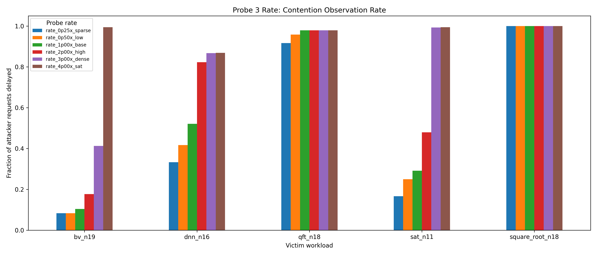

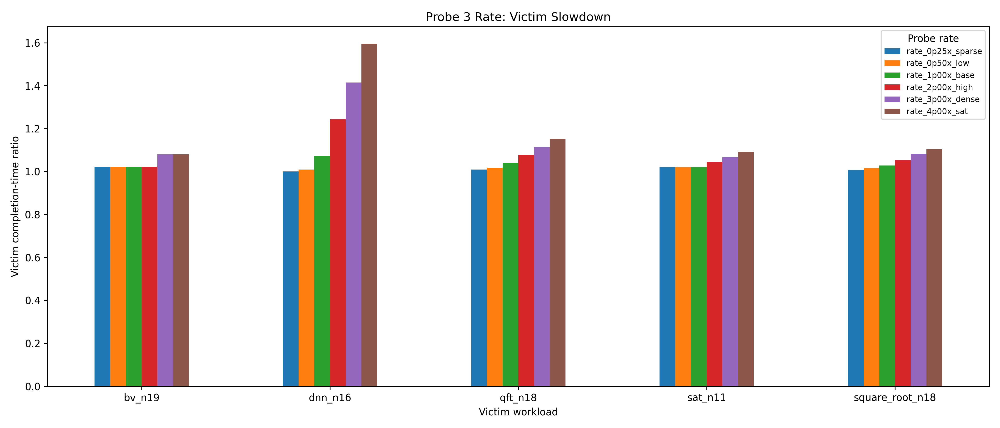

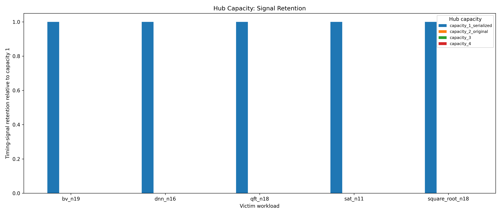

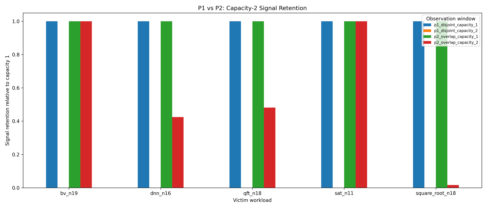

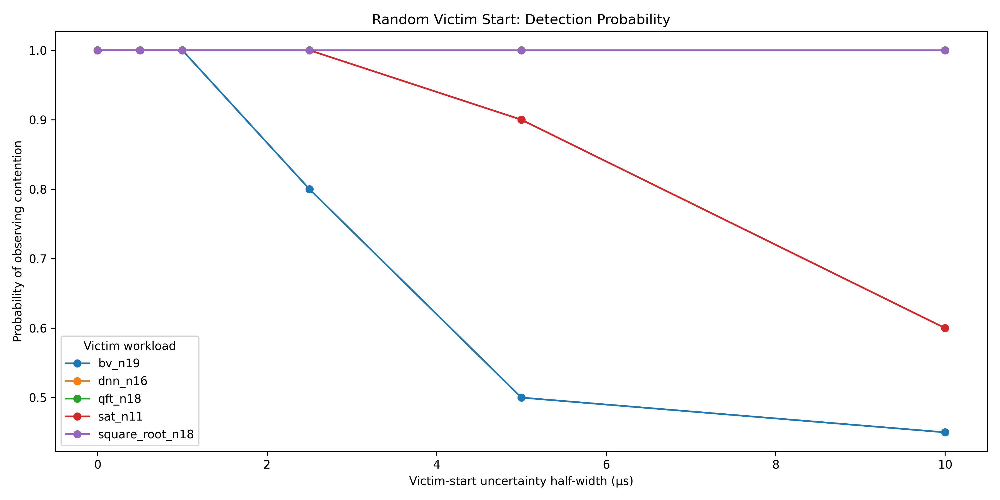

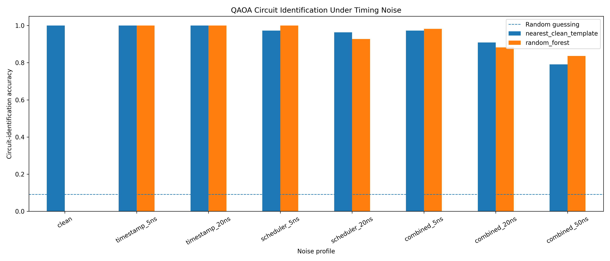

### Resource-sharing and causal-pipeline figures

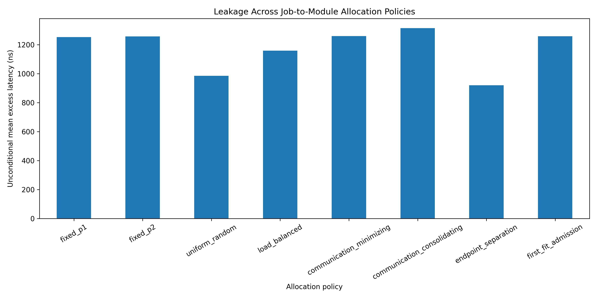

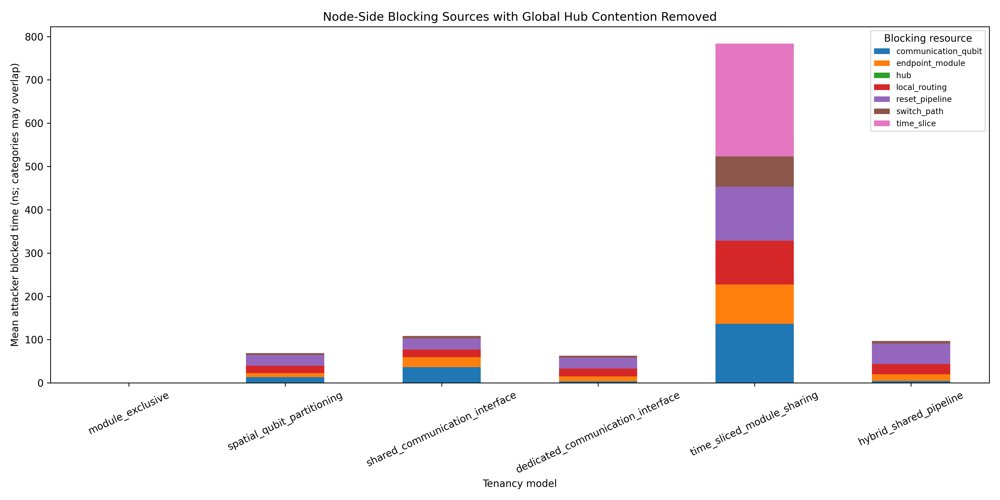

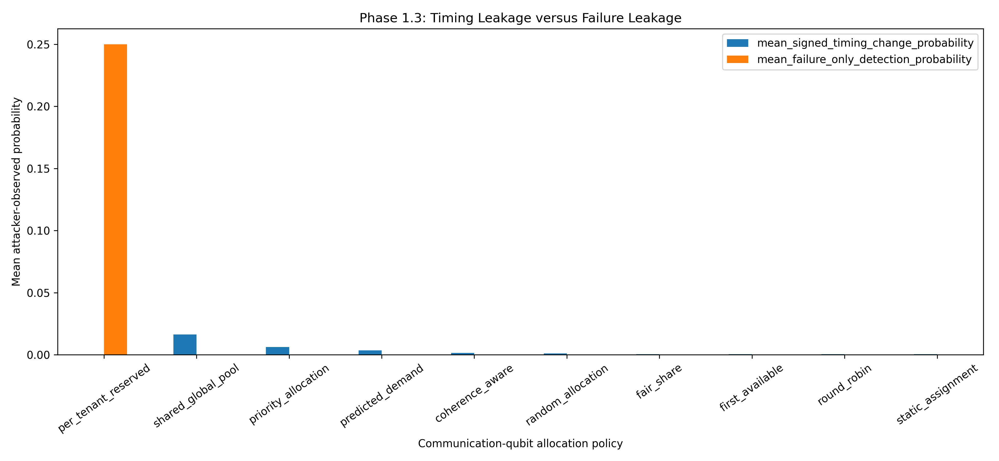

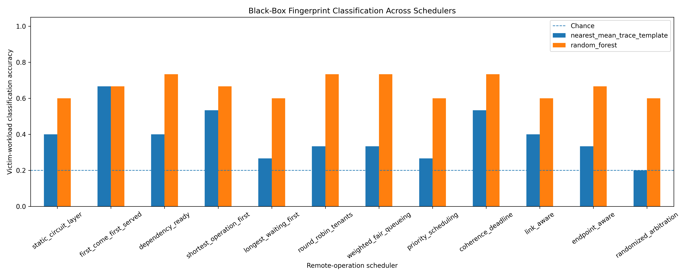

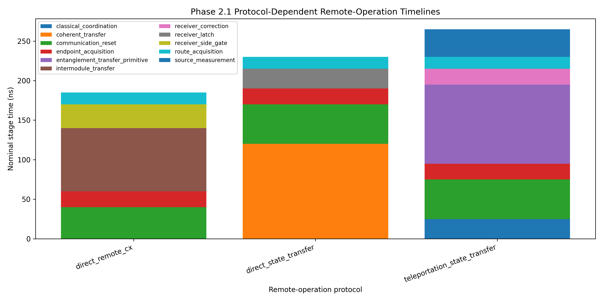

The remaining black-box result directories add plots for observation windows, inter-probe spacing, QAOA signals, allocation/tenancy, scheduler fairness, rerouting, unknown placement, resource ablation, and Phase 3 inference. CSV metrics should be treated as the source of truth; PNGs are presentation views of those tables.

## Future work

- Validate stage durations and noise assumptions against hardware or lower-level calibrated control simulations.
- Add confidence intervals and repeated outer splits for small-sample classification tasks.
- Evaluate attacker detection, rate limiting, and probe-budget defenses.
- Study timing padding, randomized scheduling, moving-target placement, and resource partitioning with explicit performance cost.
- Replace monolithic scripts with shared configuration, simulation, feature, and reporting modules.
- Add automated regression tests around saved validation assertions.
- Evaluate cross-architecture transfer rather than only domain shifts inside one simulator family.
- Explore passive observation models that do not inject attacker traffic.

## References

- `CCS_2026 (1).pdf`: conference-paper snapshot present in the GitHub version of the repository.
- [NetSquid](https://netsquid.org/)
- [Qiskit](https://qiskit.org/)

## Authors

Add author and affiliation information here.

## License

No project-level license file was present in the reviewed repository snapshot. Add an explicit license before redistribution or external reuse.

